# Gemini 3 Integration – Scan The Lie

This document provides a technical breakdown of how **Scan The Lie** leverages Google's Gemini 3 capabilities.

---

## 🧠 Core Gemini 3 Capabilities Used

### 1. Multimodal Image Understanding

Gemini 3's vision model processes **two images simultaneously** in a single API call:

```mermaid
flowchart LR
    A["📷 Front Label Image"] --> C["Gemini 3 Vision"]
    B["📷 Back Label Image"] --> C
    C --> D["Extracted Data"]
    D --> E["Product Name"]
    D --> F["Marketing Claims"]
    D --> G["Ingredients List"]
    D --> H["Nutrition Facts"]
```

**Technical Details:**
- Images encoded as base64 and sent as `inlineData` parts
- Single `Content.multi()` request contains text prompt + both images
- Model performs OCR on varied label designs, fonts, and layouts
- Extracts structured data from unstructured visual input

---

### 2. Structured JSON Output Generation

Gemini 3 outputs **strongly-typed JSON schemas** directly from visual analysis:

**Schema Highlights:**
- Nested objects: Each ingredient contains `name`, `purpose`, `riskLevel`, `isBanned`, `bannedCountries`
- Typed enums: `riskLevel` returns `low | medium | high`
- Claim verdicts: `verified | misleading | false` with supporting evidence

---

### 3. Multi-Step Logical Reasoning

The most powerful capability: **claim verification through cross-referencing**.

**Reasoning Examples:**
| Claim | Ingredient Found | Verdict | Reasoning |
|-------|------------------|---------|-----------|
| "All Natural" | Sodium Benzoate E211 | Misleading ⚠️ | E211 is a synthetic preservative |
| "No Added Sugar" | Maltodextrin | Misleading ⚠️ | Maltodextrin spikes blood sugar like glucose |
| "Heart Healthy" | Partially Hydrogenated Oil | False ❌ | Contains trans fats linked to heart disease |

---

### 4. User Context Injection

Personalized analysis through **prompt engineering with user profiles**:

```mermaid
flowchart LR
    subgraph "User Profile"
        A["Allergies: Peanuts, Dairy"]
        B["Diet: Vegetarian"]
        C["Concerns: Blood Sugar"]
    end
    
    A --> D["Custom Prompt"]
    B --> D
    C --> D
    D --> E["Gemini 3"]
    E --> F["Personalized Flags"]
    F --> G["⚠️ Contains milk derivatives"]
    F --> H["✅ Vegetarian friendly"]
    F --> I["⚠️ High glycemic index"]
```

### 5. Context-Preserving Chat

The AI chatbot maintains **product context** for follow-up questions:

---

## 🛡️ Error Handling

Robust error classification with user-friendly messages:

| Error Type | Detection | User Message |
|------------|-----------|--------------|
| Rate Limit | 429, quota | "API rate limit reached. Please wait." |
| Model Overload | 503, capacity | "AI model is busy. Try again." |
| Connectivity | SocketException | "No internet connection." |
| Invalid Key | 401, unauthorized | "Invalid API key. Check Settings." |
| Safety Filter | blocked, harmful | "Content blocked by safety filters." |

---

## 📊 Why This Matters

This project demonstrates Gemini 3 as a **a complete reasoning engine over visual data**:

1. **OCR + Understanding** – Not just reading text, but understanding context
2. **Knowledge Application** – Applying food science knowledge to verify claims
3. **Logical Verification** – Cross-referencing data within a single inference
4. **Personalization** – Adapting output based on injected user context about user's health profile

All executed through **multimodal prompts** without external databases or post-processing.

---

*Built for the Gemini 3 Global Hackathon*

