# 🔍 Scan The Lie

> **Empowering consumers to expose deceptive food marketing — one scan at a time.**

[](https://flutter.dev)
[](https://deepmind.google/technologies/gemini/)
[](LICENSE)

---

## 🎯 The Problem

In a world where **"all-natural"** claims hide artificial ingredients and **"healthy"** labels mask harmful additives, consumers are left defenseless against sophisticated marketing tactics.

- 🚨 **73%** of consumers feel misled by food marketing claims
- 🔬 **"Natural flavors"** can contain over 100 synthetic compounds
- ⚠️ Many **"organic"** products still include synthetic preservatives

---

## 💡 Our Solution

**Scan The Lie** is an AI-powered mobile application that uses **Google's Gemini 3** to instantly analyze food products, verify marketing claims against actual ingredients, and provide personalized health insights.

### ✨ Key Features

| Feature | Description |
|---------|-------------|
| 🔍 **Dual-Image Scanning** | Capture front (marketing) and back (ingredients) labels |
| ✅ **Claim Verification** | AI cross-references claims with ingredients (Verified/Misleading/False) |
| 🧬 **Deep Ingredient Analysis** | Breakdown of each ingredient: purpose, origin, controversies |
| 👤 **Personalized Compatibility** | Analysis tailored to YOUR allergies and dietary preferences |
| 📊 **Health Score** | Instant 0-100 health score with visual indicators |
| 💬 **AI Health Assistant** | Context-aware chatbot for product questions |
| 📄 **PDF Reports** | Generate and share detailed analysis reports |

---

## 🔄 How It Works

```mermaid
flowchart LR
    A["📸 Scan Labels"] --> B["🤖 Gemini 3 Analysis"]
    B --> C["✅ Claim Verification"]
    B --> D["🧬 Ingredient Analysis"]
    B --> E["👤 Personal Health Check"]
    C --> F["📊 Results Dashboard"]
    D --> F
    E --> F
    F --> G["💬 AI Chat"]
    F --> H["📄 PDF Report"]
```



---

## 🏗️ Architecture


---

## 🤖 Gemini 3 Integration

**Scan The Lie** leverages **Gemini 3 Flash Preview** for:

| Capability | How It's Used |
|------------|---------------|
| **Multimodal Vision** | Processes 2 images simultaneously, extracts text from varied label designs |
| **Structured Output** | Generates typed JSON with ingredients, claims, nutrition data |
| **Logical Reasoning** | Cross-references claims vs ingredients within single inference |
| **Context Injection** | Incorporates user health profile for personalized analysis |

📖 **[Detailed Gemini Integration Documentation →](GEMINI_INTEGRATION.md)**

---

## 🚀 Getting Started

### Prerequisites
- Flutter SDK 3.10.7+
- Gemini API Key ([Get one here](https://aistudio.google.com/apikey))

### Installation

```bash
# Clone the repository
git clone https://github.com/muhammedashharps/Scan-The-Lie-App.git
cd Scan-The-Lie-App

# Install dependencies
flutter pub get

# Run the app
flutter run
```

### Configuration
1. Launch the app
2. Go to **Settings** ⚙️
3. Enter your **Gemini API Key**
4. Complete the optional **Health Profile Questionnaire**

---

## 🛠️ Tech Stack

| Technology | Purpose |
|------------|---------|
| **Flutter** | Cross-platform mobile development |
| **Gemini 3 Flash** | Multimodal AI analysis & chatbot |
| **Hive** | Local NoSQL database |
| **PDF/Printing** | Report generation |

---


## 👨‍💻 About

Built with ❤️ for the **Gemini 3 Global Hackathon** by a developer passionate about consumer empowerment through technology.


<div align="center">

**🔍 Scan The Lie — Because you deserve to know what's really in your food.**

*Powered by Google Gemini 3*

</div>
